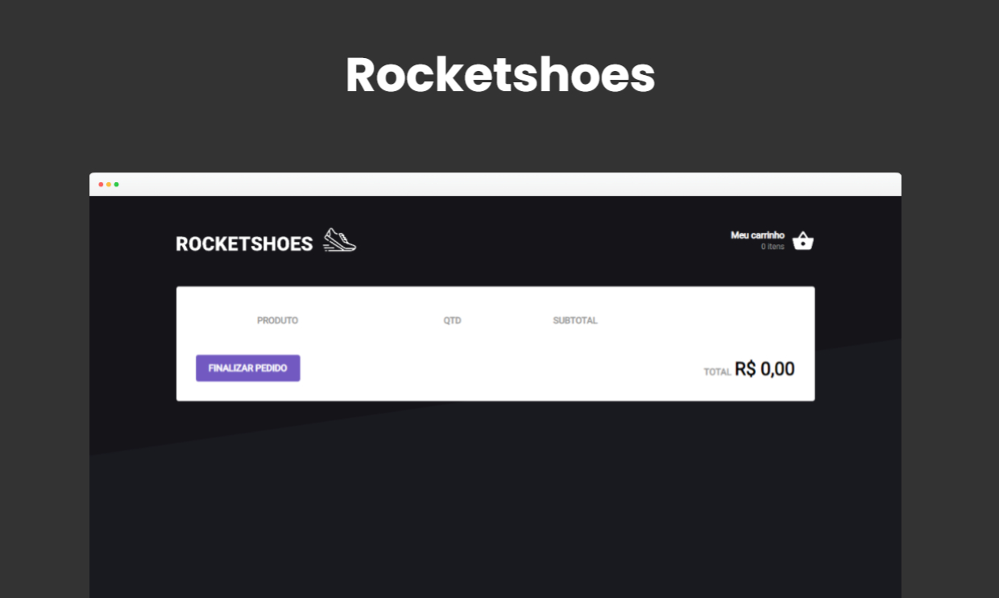

___

<div align="center">

</div>

## 💻 Desafio

Uma aplicação criada para treinar os conceitos de React  criando um hook de carrinho de compras.

Foi desenvolvida com o objetivo de treinar todos os conceitos do React aprendidos até então, como **manipulação de estado** com **useState**, hooks como o **useEffect**, trabalhar com contextos através do **useContext** e persistir dados através do local storage.



## 🚀 Tecnologias

Esse projeto foi desenvolvido com as seguintes tecnologias:

- [ReactJS](https://pt-br.reactjs.org/)
- [Typescript](https://www.typescriptlang.org/)
- [styled-components](https://styled-components.com/)
- [toastify](https://www.npmjs.com/package/react-toastify)


## 🔖 Funcionalidades:
- Adicionar um novo produto ao carrinho;
- Remover um produto do carrinho;
- Alterar a quantidade de um produto no carrinho;
- Cálculo dos preços sub-total e total do carrinho;
- Validação de estoque;
- Exibição de mensagens de erro;


```bash
# Clone this project
$ git clone https://github.com/ricardoltt/rocketshoes

# Access
$ cd rocketshoes

# Install dependencies
$ yarn

# Run the project
$ yarn dev

# The server will initialize in the <http://localhost:8080>
```

<div align="center">

### Let's code! 🚀

Made with love by **Ricardo Temoteo** ❤️ Me adiciona no [Linkedin!](https://www.linkedin.com/in/ricardoltt/)

</div>